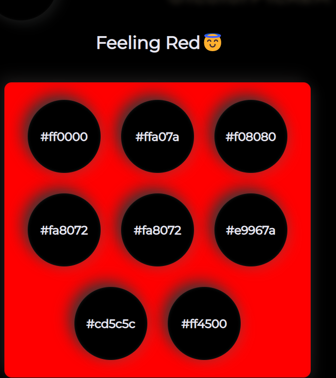
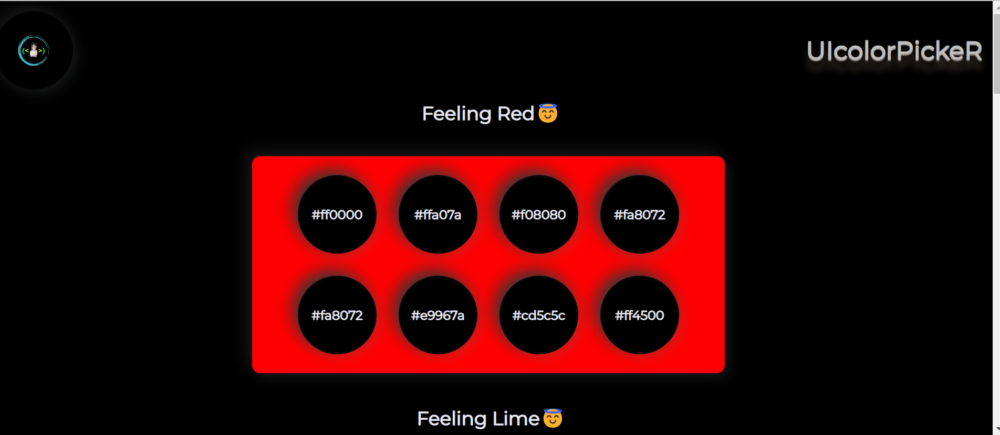

# Hex Code for Selected Colour

- Create HTML CSS AND JS Files
- Create the strc in HTML 
- Create Nav bar 
-Create seven container inside create the child class 

- Add the design in css files
- in side js file add the addEventListener and target the value 
- add design using getElementById 
- When a user selects any particular colour, it shows the Hex code .
- it is responsive for all the devices
---
Image 

----

Image 

